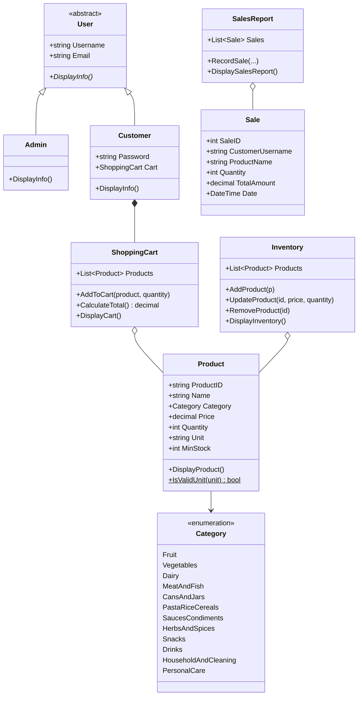

# PalengKart Store System

A console inventory and point-of-sale system for a small store, written in C# (.NET 10).

## Features

**Admin**
- View, add, update and remove products
- Low stock alerts based on each product's minimum stock
- Sales report of every checkout

**Customer**
- Create an account and log in with a password
- Browse products, add them to a shopping cart and check out

**Store**
- 12 product categories (Fruit, Vegetables, Dairy, and more) and units (kg, pc, bottle, and more)
- Auto-generated EAN-13 product IDs (with check digit), shown as a simple ASCII barcode
- Inventory saved to `inventory.txt` after every change

## Requirements

- .NET 10 SDK

## Run

```bash
dotnet run
```

On first run, five sample products are added.

| Login | How |
|---|---|
| Admin | Username `admin` |
| Customer | Any new username creates an account (email and password) |

Customer accounts and sales are kept in memory and reset when the program closes. Only the inventory is saved.

## Project structure

| File | Description |
|---|---|
| `Program.cs` | Main menu, admin menu and customer menu |
| `User.cs` | Abstract base class for all users |
| `Admin.cs` | Admin user (inherits `User`) |
| `Customer.cs` | Customer user with a password and a shopping cart (inherits `User`) |
| `Product.cs` | Product with ID, category, price, quantity and unit |
| `Category.cs` | Product categories |
| `Inventory.cs` | Product list, stock changes, and saving/loading `inventory.txt` |
| `ShoppingCart.cs` | Customer's cart and total |
| `Sale.cs` | One sold item |
| `SalesReport.cs` | List of all sales and the report |
| `BarcodeGenerator.cs` | EAN-13 barcode generation and display |

## Branches

| Branch | What it is |
|---|---|
| `main` | Stable, checked version of the project |
| `development` | Finished features are collected here, then merged into `main` by pull request |
| `feat/<area>` | Work in progress (for example `feat/models`, `feat/menu`, `feat/docs`), merged into `development` by pull request |

Each commit adds one thing and builds on its own. Commit messages are one line: `type(area): what changed`, for example `feat(cart): add ShoppingCart`. Types are `feat`, `fix`, `docs`, `ci` and `chore`.

Every push and pull request to `main` or `development` is built by GitHub Actions.

## Class diagram



<div align="center">

**CPE261 Object Oriented Programming 1 · 2024** · Instructor: Engr. Julian M. Semblante

</div>
