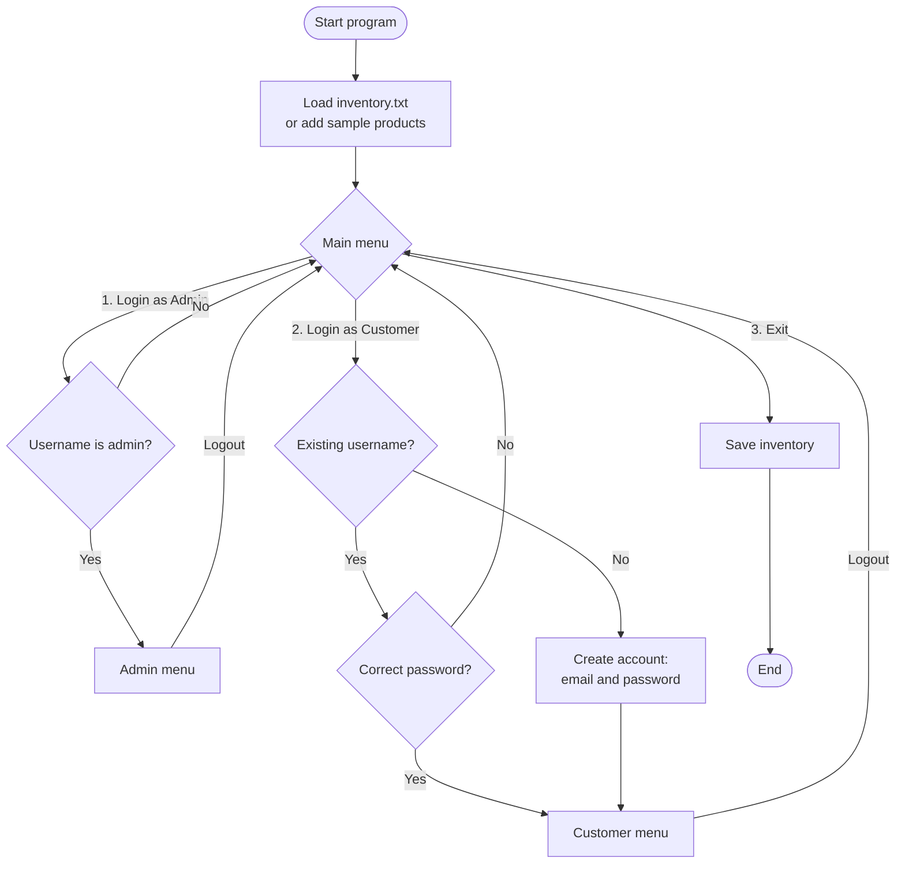
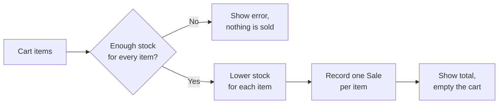
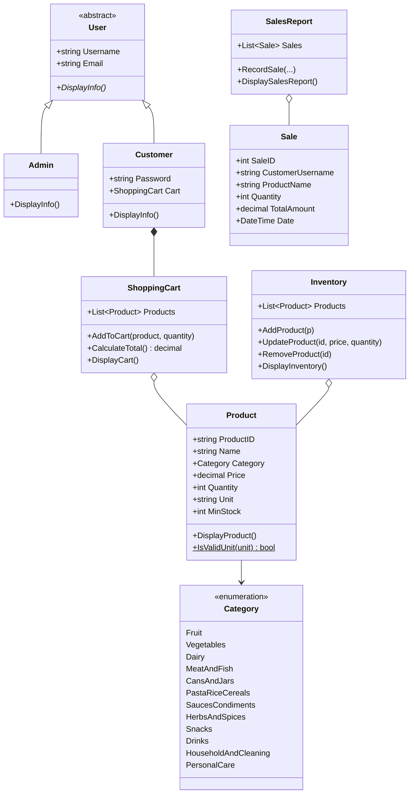

# PalengKart — Project Documentation

> **Status:** v1.0 — complete console application. It follows the PalengKart class diagram (CPE261 Object Oriented Programming 1).
> Diagrams are written in [Mermaid](https://mermaid.js.org/) and render directly on GitHub.

## Table of Contents

1. [Project Information](#1-project-information)
2. [Overview](#2-overview)
3. [User Flow](#3-user-flow)
4. [Features Breakdown](#4-features-breakdown)
5. [Core Concepts](#5-core-concepts)
6. [Class Design](#6-class-design)
7. [Data Storage](#7-data-storage)
8. [Setup and Running](#8-setup-and-running)
9. [Testing](#9-testing)
10. [Known Limitations](#10-known-limitations)

---

## 1. Project Information

### Repository

[helidastar/PalengKart-Console](https://github.com/helidastar/PalengKart-Console) · C# · .NET 10 · console application

### Course

CPE261 Object Oriented Programming 1 · 2024 · Instructor: Engr. Julian M. Semblante

### Branches

| Branch | What it is |
|---|---|
| `main` | Stable, checked version of the project |
| `development` | Finished features are collected here, then merged into `main` by pull request |
| `feat/<area>` | Work in progress (for example `feat/models`, `feat/menu`, `feat/docs`), merged into `development` by pull request and deleted after merging |

### Commit rules

- Each commit adds one thing and builds on its own.
- Messages are one line: `type(area): what changed`, for example `feat(cart): add ShoppingCart`.
- Types: `feat` (new feature), `fix` (bug fix), `docs` (documentation), `ci` (GitHub Actions), `chore` (setup and upkeep).

Every push and pull request to `main` or `development` is built by GitHub Actions (`.github/workflows/dotnet.yml`).

### Contributors

| Name | GitHub |
|---|---|
| Charity T. Ricabo | [@helidastar](https://github.com/helidastar) |

---

## 2. Overview

### 2.1 Problem

Small stores and market stalls ("palengke") often track stock on paper. It is hard to know what is running low, what was sold, and how much was earned.

### 2.2 Goals

- Keep one list of products with their category, price, quantity and unit
- Let customers build a cart and check out, with stock lowered automatically
- Record every sale so the admin can see a sales report
- Warn the admin when a product is running low
- Show the main object-oriented programming concepts: abstraction, inheritance, polymorphism, encapsulation and composition

### 2.3 Users

| User | What they do |
|---|---|
| Admin | Manages products, checks low stock, reads the sales report |
| Customer | Creates an account, browses products, buys using a cart |

---

## 3. User Flow



### 3.1 Checkout



Every item is checked before anything is sold, so a checkout never goes through half-way.

---

## 4. Features Breakdown

### 4.1 Main menu

| Option | What it does |
|---|---|
| 1. Login as Admin | Asks for the admin username (`admin`) |
| 2. Login as Customer | Logs in, or creates an account for a new username |
| 3. Exit | Saves the inventory and closes the program |

### 4.2 Admin menu

| Option | What it does |
|---|---|
| 1. View Inventory | Lists all products, grouped by category |
| 2. Add Product | Generates a product ID (barcode), then asks for name, category, price, unit, quantity and minimum stock |
| 3. Update Product | Changes the price and/or quantity (press Enter to keep the old value) |
| 4. Remove Product | Removes a product after a Y/N confirmation |
| 5. Low Stock Alerts | Lists products at or below their minimum stock |
| 6. Sales Report | Lists every sale with date, customer, product, quantity and amount, plus the total |
| 7. Logout | Returns to the main menu |

### 4.3 Customer menu

| Option | What it does |
|---|---|
| 1. View Products | Lists all products |
| 2. Add to Cart | Scan or enter a product ID, then a quantity (cannot be more than what is in stock) |
| 3. View Cart | Shows each item, its subtotal and the cart total |
| 4. Checkout | Buys everything in the cart (see [3.1 Checkout](#31-checkout)) |
| 5. Logout | Returns to the main menu; the cart is kept for the next login |

---

## 5. Core Concepts

### 5.1 Categories

`Fruit`, `Vegetables`, `Dairy`, `MeatAndFish`, `CansAndJars`, `PastaRiceCereals`, `SaucesCondiments`, `HerbsAndSpices`, `Snacks`, `Drinks`, `HouseholdAndCleaning`, `PersonalCare`

### 5.2 Units

`pc`, `kg`, `g`, `L`, `mL`, `pack`, `bottle`, `can`, `sack`, `dozen`. `Product.IsValidUnit()` checks a unit against this list (not case-sensitive).

### 5.3 Product ID (barcode)

Every product ID is a 13-digit EAN-13 barcode, generated by `BarcodeGenerator`:

- `890` prefix + 9 random digits + 1 check digit
- The check digit is calculated the EAN-13 way, so real barcode scanners accept it
- A new ID is never the same as an existing product's ID
- It is shown as a simple ASCII barcode when a product is added

### 5.4 Low stock

Each product has a `MinStock`. A product is low on stock when `Quantity <= MinStock`.

### 5.5 Input checks

- Numbers are read with `TryParse`; wrong input (letters, negative numbers) asks again instead of crashing
- Quantities to buy must be at least 1 and no more than what is in stock
- Category is picked by number (1–12); unit must be one of the listed units
- The `|` character in names is saved as `/`, since `|` separates fields in the save file

---

## 6. Class Design

### 6.1 Class diagram



### 6.2 Classes

| Class | File | Responsibility |
|---|---|---|
| `User` *(abstract)* | `User.cs` | Base class for every user: `Username`, `Email`, abstract `DisplayInfo()` |
| `Admin` | `Admin.cs` | Admin user; overrides `DisplayInfo()` |
| `Customer` | `Customer.cs` | Customer user with a `Password` and a `Cart`; overrides `DisplayInfo()` |
| `Product` | `Product.cs` | One product: `ProductID`, `Name`, `Category`, `Price`, `Quantity`, `Unit`, `MinStock`; `DisplayProduct()`, `IsValidUnit()` |
| `Category` *(enum)* | `Category.cs` | The 12 product categories |
| `Inventory` | `Inventory.cs` | Product list; add, update, remove, display, lower stock, low stock list, save and load |
| `ShoppingCart` | `ShoppingCart.cs` | A customer's items; `AddToCart()`, `CalculateTotal()`, `DisplayCart()` |
| `Sale` | `Sale.cs` | One sold item: `SaleID`, `CustomerUsername`, `ProductName`, `Quantity`, `TotalAmount`, `Date` |
| `SalesReport` | `SalesReport.cs` | All sales; `RecordSale()`, `DisplaySalesReport()` |
| `BarcodeGenerator` *(static)* | `BarcodeGenerator.cs` | EAN-13 product IDs and the ASCII barcode |
| `Program` | `Program.cs` | Menus: `Main()`, `HandleAdmin()`, `HandleCustomer()`, and the product actions |

### 6.3 Object-oriented concepts used

| Concept | Where |
|---|---|
| **Abstraction** | `User` is abstract and cannot be created on its own; it only says every user must have `DisplayInfo()` |
| **Inheritance** | `Admin` and `Customer` inherit `Username` and `Email` from `User` (`: base(username, email)`) |
| **Polymorphism** | `Admin` and `Customer` each `override` `DisplayInfo()` and print different information |
| **Encapsulation** | Data is kept in properties; `Inventory` is the only class that changes stock and writes the save file |
| **Composition** | A `Customer` has a `ShoppingCart`; `Inventory`, `ShoppingCart` and `SalesReport` hold lists of objects |
| **Enumeration** | `Category` limits categories to a fixed set of values |

---

## 7. Data Storage

The inventory is saved to `inventory.txt` (in the folder the program runs from) after every change and on exit. One product per line, fields separated by `|`:

```
ProductID|Name|Category|Price|Quantity|Unit|MinStock
8903550333821|Rice|PastaRiceCereals|55|95|kg|20
```

- Numbers are saved with the invariant culture (`.` for decimals), so the file loads the same on any PC
- A line that cannot be read is skipped with a warning instead of crashing the program
- If the file is missing or has no valid products, five sample products are added

Customer accounts and sales are kept in memory only (see [Known Limitations](#10-known-limitations)).

---

## 8. Setup and Running

### Download (no .NET needed)

1. Download [PalengKart.exe](https://github.com/helidastar/PalengKart-Console/releases/latest/download/PalengKart.exe) from the [Releases](https://github.com/helidastar/PalengKart-Console/releases) page (Windows 10/11, 64-bit)
2. Put it in its own folder; it saves `inventory.txt` next to itself
3. Double-click it to run
4. If Windows shows "Windows protected your PC", click **More info** → **Run anyway** (the file is not code-signed)

### Run from source

#### Requirements

- [.NET 10 SDK](https://dotnet.microsoft.com/download)

#### Run

```bash
git clone https://github.com/helidastar/PalengKart-Console.git
cd PalengKart-Console
dotnet run
```

### Logins

| Login | How |
|---|---|
| Admin | Username `admin` |
| Customer | Any new username creates an account (email and password) |

### Sample products

| Product | Category | Price | Quantity | Min stock |
|---|---|---|---|---|
| Rice | PastaRiceCereals | ₱55.00 / kg | 100 | 20 |
| Cooking Oil | SaucesCondiments | ₱120.00 / bottle | 30 | 5 |
| Eggs | Dairy | ₱9.00 / pc | 60 | 12 |
| Tomato | Vegetables | ₱80.00 / kg | 15 | 5 |
| Banana | Fruit | ₱70.00 / kg | 4 | 5 |

Banana starts below its minimum stock, so the low stock alert has something to show.

To start over, delete `inventory.txt`.

---

## 9. Testing

Tested with a scripted run of a full customer and admin session:

| Test | Result |
|---|---|
| New customer creates an account | Account created |
| Existing customer, wrong password | Rejected |
| Add 5 kg rice and 12 eggs to cart | Cart total ₱383.00 |
| Ask for more bananas than in stock | Rejected: insufficient stock |
| Type `abc` as a quantity | Asks again |
| Checkout | Stock lowered: rice 100 → 95, eggs 60 → 48 |
| Admin sales report | Both sales listed, total ₱383.00 |
| Admin low stock alerts | Banana listed (4 kg, min 5) |
| Add product with invalid category number and unit | Asks again; product saved correctly |
| Save file after exit | All products saved in the correct format |

GitHub Actions builds every push and pull request to `main` and `development`.

---

## 10. Known Limitations

- **Admin has no password.** The class diagram gives `Admin` no password property, so the admin logs in with the username `admin` only.
- **Customer accounts and sales are not saved.** They reset when the program closes; only the inventory is saved to a file.
- **Customer passwords are stored as plain text in memory.** Fine for a class project, not for a real store.
- **Quantities are whole numbers.** Half a kilo cannot be sold; use a smaller unit (for example `g`) instead.
- **One admin account.** The admin username is set in `Program.cs`.
